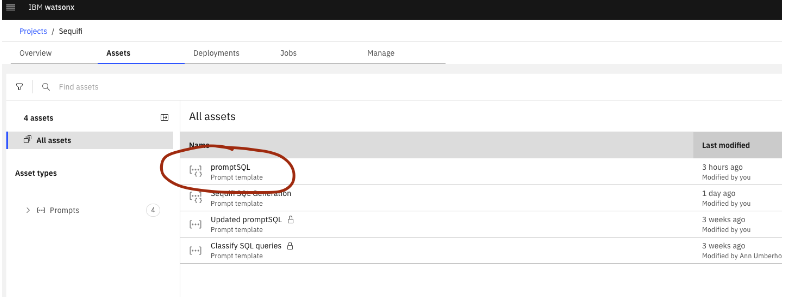

# How to handle using dynamic prompt templates with watsonx.ai 

When working with AI large language models, the prompts need to be updated and tested frequently. If an application makes an api call to a large language model with the prompt it is beneficial to be able to retreive the prompt dynamically to ensure one is retreiving the lastest version.  Within watsonx.ai, the mechanism to do this is to create a deployment space that can be retrieved by knowing the Space ID. 

Follow the steps below to promote the prompt template to deployment space 

1. Save your prompts as a Prompt Template named `promptSQL` and `promptClassify`.  See examples in the [prompts](./prompts) subdirectory.

1. Open the prompt template in Watsonx AI project. Go to **Assets**.
   

1. To be able to promote this as a template, we need to create a prompt variable within the prompt.  This can be anything like `userid`.  Click on `{#}` button on top right and create the `userid` prompt variable.  To refer to the prompt variable in the prompt use `{userid}`. 

1. Go back to the project and click on three dots (ellipsis) in front of prompt template. Click on **Promote to space**. 

1. If you don’t have a target deployment space, create a new deployment space. Enter all the details as shown below. 

1. Now select the target deployment space and click on promote. 

1. Click on hamburger menu on top of IBM watsonx. Select **Deployments**. 

1. Click on the deployment space you created above

1. Click on ellipsis and **Deploy**. 

1. Create a deployment 

Note:  
1) For this application please make sure the name of prompt templates are `promptSQL` and `promptClassify`. 
 
2) You have to create at least one prompt variable (step 2) to get an option to promote the prompt template to deployment space. 

Adding Space ID to env file 

After you create a deployment space (Step 7 above). Go to the deployment space (screenshot of step 8) and click on Manage tab. 
 
Copy the Space GUID from above and add it to the WX_SPACE_ID in your .env file of the project. 
